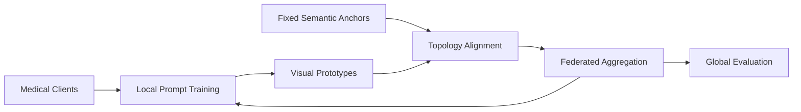

<div align="center">

# FedMAP

### Rethinking Federated Prompt Learning for Medical Images: From Textual Tuning to Visual Manifold Anchoring

**ICML 2026 Regular Paper**

<p>
  <b>Federated Learning</b> ·
  <b>Medical Imaging</b> ·
  <b>Prompt Learning</b> ·
  <b>CLIP</b>
</p>

<p>
  <a href="#what-is-fedmap">What is FedMAP?</a> ·
  <a href="#quick-start">Quick Start</a> ·
  <a href="#methods">Methods</a> ·
  <a href="#reproducibility">Reproducibility</a> ·
  <a href="#citation">Citation</a>
</p>

</div>

---

## 🌟 What is FedMAP?

FedMAP is a federated prompt learning framework for medical image classification with CLIP-style vision-language models. The project asks a simple question: if medical clients already share strong class-level semantics, should federated prompt learning keep spending most of its capacity on textual tuning?

FedMAP shifts the center of gravity from **textual prompt adaptation** to **visual manifold anchoring**. It keeps fixed semantic class anchors as a shared reference, tracks visual prototypes during federated optimization, and aligns the visual structure across clients without exposing raw medical images.



## ✨ Highlights

| Icon | Feature | Why it matters |
| --- | --- | --- |
| 🧭 | Semantic anchoring | Stable text-side class anchors provide a shared coordinate system across hospitals and clients. |
| 🧬 | Visual manifold alignment | Client visual prototypes are optimized to preserve class-level topology instead of only tuning prompt tokens. |
| 🛰️ | Federated optimization | Local updates stay lightweight and are aggregated through the public federated training loop. |
| 🧪 | Reproducible public surface | The release keeps runnable methods, public dataset protocols, launcher scripts, and smoke-testable configs. |

## 🧱 Repository Map

```text
FedMAP/
├── Scripts/
│   ├── federated_main.py        # federated training entrypoint
│   ├── run_experiment.sh        # one-command public launcher
│   ├── trainers/                # FedMAP and public baselines
│   ├── datasets/                # public dataset wrappers
│   ├── configs/datasets/        # federated dataset protocols
│   ├── embeddings/              # minimal semantic anchor resources
│   ├── Dassl/                   # local training infrastructure
│   ├── clip/                    # CLIP implementation used by trainers
│   └── utils/                   # config, FL, logging, and aggregation helpers
├── requirements.txt
├── LICENSE
└── README.md
```

Local-only folders such as `Scripts/output/`, `Scripts/logs/`, raw `Scripts/data/`, caches, and internal notes are intentionally excluded from git.

## ⚙️ Installation

```bash
git clone https://github.com/YipanWei/FedMAP.git
cd FedMAP

conda create -n fedmap python=3.10 -y
conda activate fedmap
pip install -r requirements.txt
```

Install a CUDA-enabled PyTorch build that matches your machine if the default package resolver does not select the correct one.

## 🩺 Data Preparation

Put raw datasets under:

```text
Scripts/data/
```

The public release supports:

| Dataset key | Dataset wrapper | Clients |
| --- | --- | --- |
| `fedisic` | `FedISIC` | 6 |
| `fedcamelyon` | `FedCamelyon17MD` | 5 |

Dataset behavior is controlled by YAML files in:

```text
Scripts/configs/datasets/
```

Minimal released semantic resources are kept under:

```text
Scripts/embeddings/<dataset>/text/
```

For each public dataset, `*_template_attributes.pt` is used by `FedMAP`, and `*_class_attributes.pt` is used by `FedMVP`.

The repository does not redistribute raw medical datasets. Users should obtain datasets from their official sources and arrange them according to the dataset wrappers.

## 🚀 Quick Start

Run FedMAP on Fed-ISIC:

```bash
bash Scripts/run_experiment.sh \
  --trainer FedMAP \
  --dataset fedisic \
  --seed 1 \
  --gpu 0
```

Switch method or dataset:

```bash
bash Scripts/run_experiment.sh --trainer FedCLIP --dataset fedcamelyon --seed 1 --gpu 0
bash Scripts/run_experiment.sh --trainer FedMVP  --dataset fedisic     --seed 42 --gpu 1
```

Run a short method smoke test:

```bash
bash Scripts/run_experiment.sh \
  --trainer FedProxLPT \
  --dataset fedisic \
  --seed 1 \
  --gpu 0 \
  --num_workers 0 \
  OPTIM.ROUND 2 OPTIM.MAX_EPOCH 1 OUTPUT_DIR output/smoke_fedproxlpt
```

Extra arguments after the launcher options are passed directly to `federated_main.py` / the YACS config system.

## 🧠 Methods

| Trainer | Role |
| --- | --- |
| `FedMAP` | FedMAP-style visual prompt tuning with manifold anchoring. |
| `VPT` | Visual prompt tuning baseline. |
| `PROMPTFL` | Federated prompt learning baseline. |
| `FedCLIP` | Federated CLIP-style prompt baseline. |
| `FedAPT` | Federated adaptive prompt tuning baseline. |
| `FedCoCoOP` | Federated CoCoOP-style baseline. |
| `FedKgCoOP` | Knowledge-guided CoCoOP-style baseline. |
| `FedMVP` | Multi-view prompt baseline. |
| `FedProxLPT` | FedProx regularized language prompt tuning baseline. |
| `FOCoOP` | Federated out-of-distribution CoOp-style baseline. |
| `CLIP` | Zero-shot / frozen CLIP reference. |

## 🧪 Reproducibility

Default public configs use `50` federated rounds and `1` local epoch:

```text
OPTIM.ROUND: 50
OPTIM.MAX_EPOCH: 1
```

Useful launcher knobs:

| Option | Meaning |
| --- | --- |
| `--trainer` | Method name, e.g. `FedMAP`, `FedCLIP`, `PROMPTFL`. |
| `--dataset` | Public dataset key: `fedisic` or `fedcamelyon`. |
| `--seed` | Random seed. |
| `--gpu` | CUDA device exposed to the run. |
| `--root` | Dataset root. Defaults to `Scripts/data`. |
| `--num_workers` | DataLoader workers. Use `0` in restricted environments. |
| `OPTIM.ROUND 1` | YACS override for quick smoke runs. |
| `OUTPUT_DIR output/my_run` | YACS override for isolated output folders. |

Outputs are generated locally:

```text
Scripts/output/<dataset>/beta:<beta>/<trainer>/
Scripts/logs/
```

These folders are ignored by git so the public repository remains lightweight.

## ✅ Release Check

The public release has been smoke-tested with all listed trainers on `fedisic` using `OPTIM.ROUND=1`, and a 2-round regression check was run for `FedProxLPT` to cover its FedProx regularization path.

## 📌 Paper

**Rethinking Federated Prompt Learning for Medical Images: From Textual Tuning to Visual Manifold Anchoring**<br>
Yipan Wei<br>
International Conference on Machine Learning (ICML), 2026

OpenReview: https://openreview.net/forum?id=3LymHCdeRd

## 📚 Citation

```bibtex
@inproceedings{wei2026rethinking,
  title={Rethinking Federated Prompt Learning for Medical Images: From Textual Tuning to Visual Manifold Anchoring},
  author={Wei, Yipan},
  booktitle={International Conference on Machine Learning},
  year={2026}
}
```

## 📄 License

This repository is released under the MIT License.
