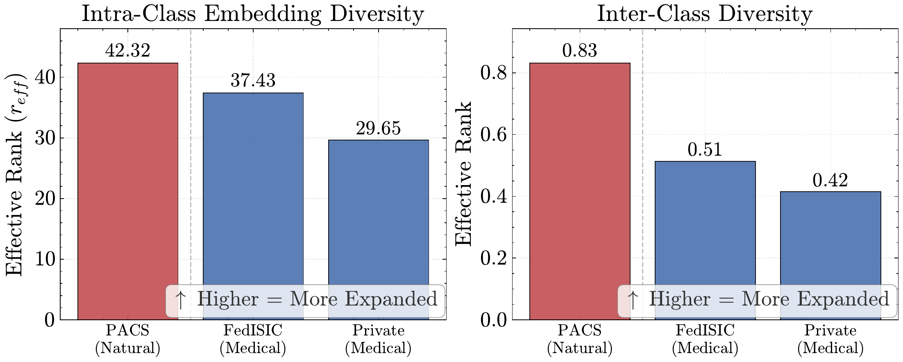
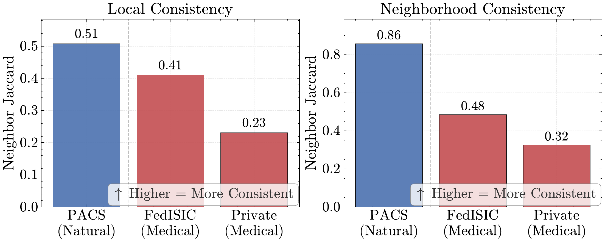
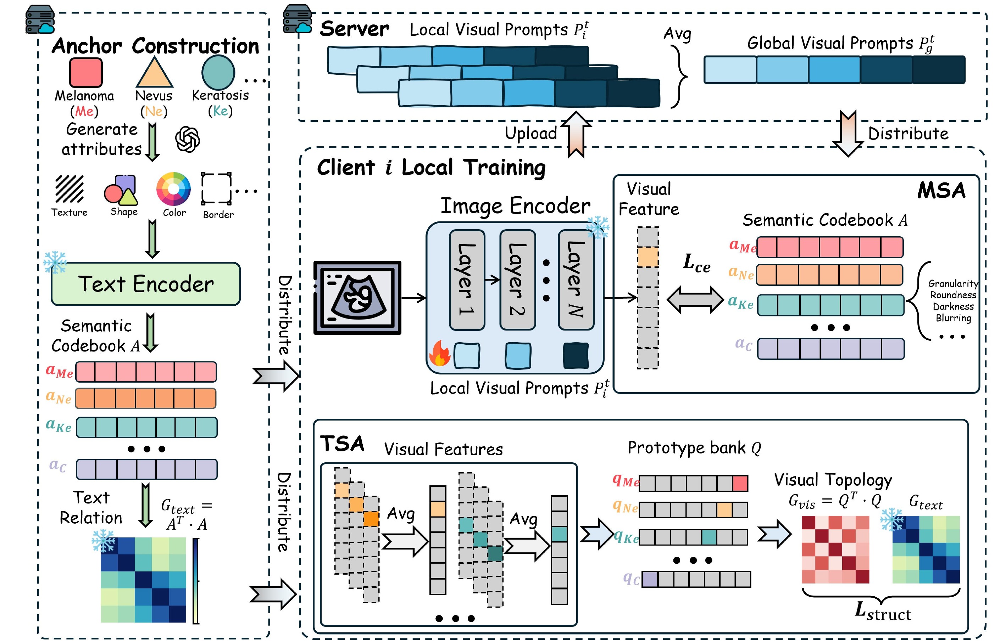
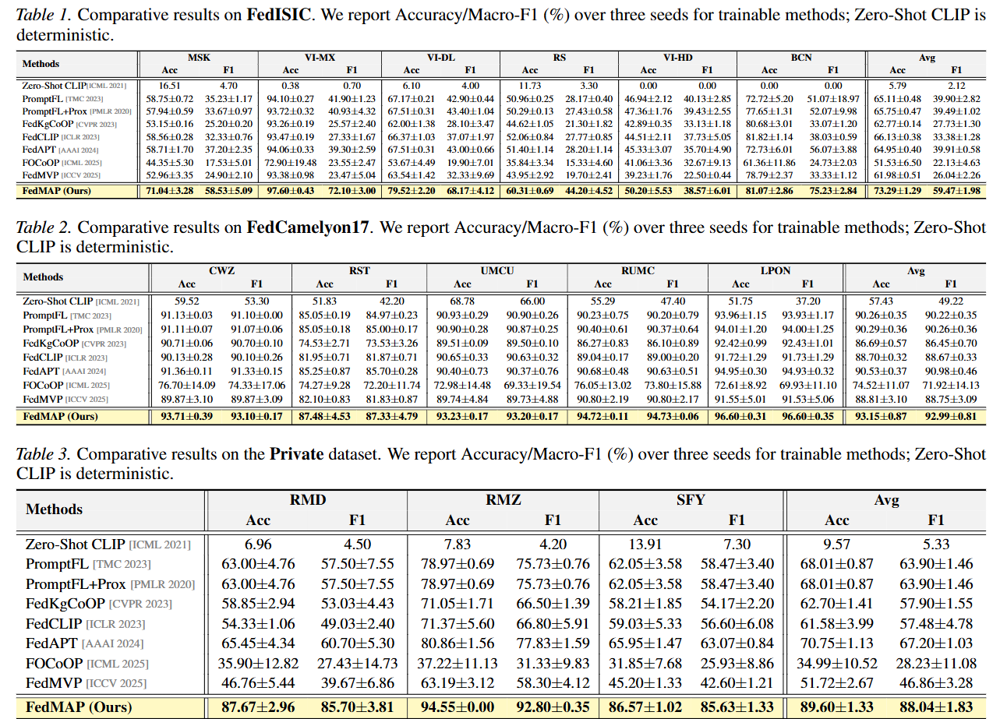
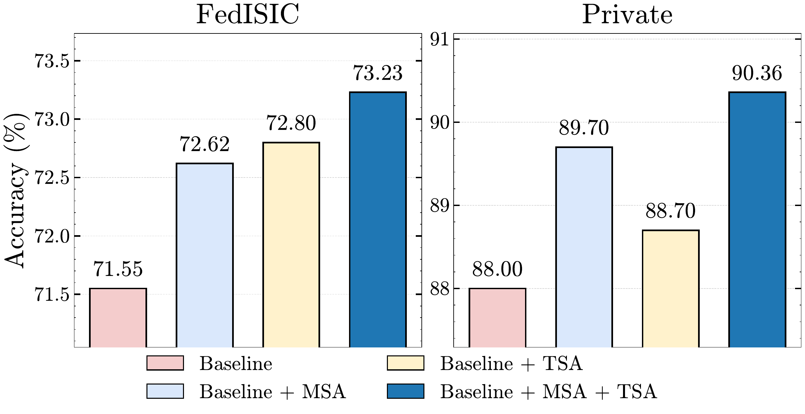
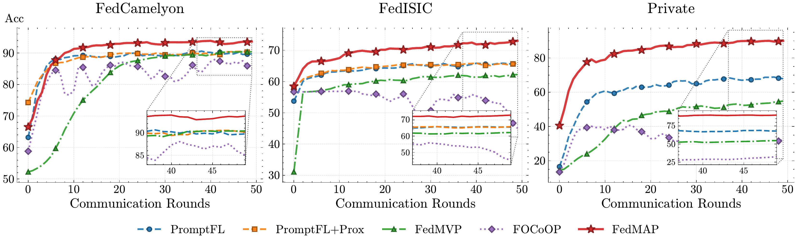
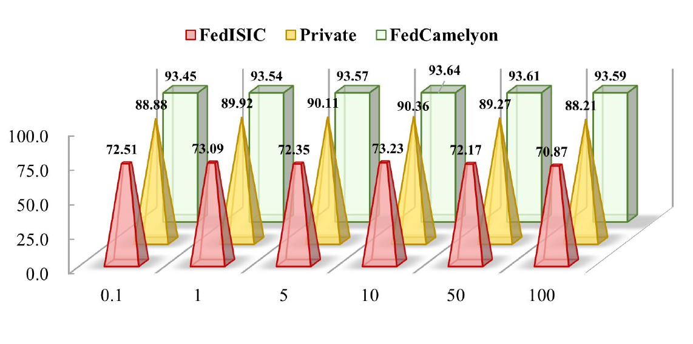

<div align="center">

# FedMAP

### Rethinking Federated Prompt Learning for Medical Images: From Textual Tuning to Visual Manifold Anchoring

**ICML 2026 Regular Paper**

<p>
  <b>Federated Learning</b> ·
  <b>Medical Imaging</b> ·
  <b>Prompt Learning</b> ·
  <b>CLIP</b>
</p>

<p>
  <a href="#-motivation">Motivation</a> ·
  <a href="#-method">Method</a> ·
  <a href="#-main-results">Main Results</a> ·
  <a href="#-quick-start">Quick Start</a> ·
  <a href="#-citation">Citation</a>
</p>

</div>

---

## 🔍 Motivation

Federated prompt learning usually treats CLIP's frozen image encoder as a reliable visual geometry and adapts lightweight textual prompts across clients. In medical images, this assumption is fragile: subtle morphology, center-specific acquisition protocols, and strong inter-class similarity can collapse visual manifolds and misalign neighborhood structure across hospitals.

FedMAP reframes the problem from **textual tuning** to **visual manifold anchoring**. It keeps semantic class anchors as a shared reference and regularizes the client-side visual space so that local prompt updates preserve a more stable medical feature geometry.

<p align="center">
  
  
</p>

## 🧩 Method

FedMAP inserts lightweight visual prompts into the frozen CLIP image encoder and optimizes them in a federated loop. A server-side semantic codebook provides a client-invariant reference, while each client learns visual prompts using both classification supervision and geometry-aware regularization.

<p align="center">
  
</p>

Core components:

- **Manifold Semantic Anchoring (MSA):** aligns image features with LLM-derived semantic anchors to recover discriminative visual directions.
- **Topology Structural Alignment (TSA):** matches the visual class-relation matrix to the text-derived relation matrix to stabilize inter-class topology.
- **Federated prompt aggregation:** uploads only lightweight visual prompt parameters; raw medical data remains local.

## 🏆 Main Results

FedMAP consistently improves over federated prompt-learning and CLIP adaptation baselines on dermoscopy, histopathology, and a private ultrasound benchmark. The private benchmark is reported as part of the paper results, but the public code release does not redistribute private data.

<p align="center">
  
</p>

Summary over the strongest baselines:

| Benchmark | FedMAP Accuracy | FedMAP Macro-F1 | Improvement |
| --- | ---: | ---: | --- |
| FedISIC | 73.29 ± 1.29 | 59.47 ± 1.98 | +7.16 Acc / +19.56 F1 |
| FedCamelyon17 | 93.15 ± 0.87 | 92.99 ± 0.81 | +2.62 Acc / +2.01 F1 |
| Private ultrasound | 89.60 ± 1.33 | 88.04 ± 1.83 | +18.85 Acc / +20.84 F1 |

## 📊 Analysis

The analysis studies whether the gain comes from the proposed geometry constraints rather than from larger trainable capacity. FedMAP benefits from both MSA and TSA, converges faster across communication rounds, and remains stable across a broad structural-loss range.

<p align="center">
  
</p>

<p align="center">
  
</p>

<p align="center">
  
</p>

## 🗂️ Repository Map

```text
FedMAP/
├── Scripts/
│   ├── federated_main.py        # federated training entrypoint
│   ├── run_experiment.sh        # one-command public launcher
│   ├── trainers/                # FedMAP and public baselines
│   ├── datasets/                # public dataset wrappers
│   ├── configs/datasets/        # federated dataset protocols
│   ├── embeddings/              # minimal semantic-anchor resources
│   ├── Dassl/                   # local training infrastructure
│   ├── clip/                    # CLIP implementation used by trainers
│   └── utils/                   # config, FL, logging, and aggregation helpers
├── assets/readme/               # lightweight README figures
├── requirements.txt
├── LICENSE
└── README.md
```

Local-only folders such as `Scripts/output/`, `Scripts/logs/`, raw `Scripts/data/`, caches, and internal notes are intentionally excluded from git.

## ⚙️ Installation

```bash
git clone https://github.com/YipanWei/FedMAP.git
cd FedMAP

conda create -n fedmap python=3.10 -y
conda activate fedmap
pip install -r requirements.txt
```

Install a CUDA-enabled PyTorch build that matches your machine if the default package resolver does not select the correct one.

## 🩺 Data Preparation

Put raw datasets under:

```text
Scripts/data/
```

The public release supports:

| Dataset key | Dataset wrapper | Clients |
| --- | --- | ---: |
| `fedisic` | `FedISIC` | 6 |
| `fedcamelyon` | `FedCamelyon17MD` | 5 |

Dataset behavior is controlled by YAML files in:

```text
Scripts/configs/datasets/
```

Minimal released semantic resources are kept under:

```text
Scripts/embeddings/<dataset>/text/
```

For each public dataset, `*_template_attributes.pt` is used by `FedMAP`, and `*_class_attributes.pt` is used by `FedMVP`.

The repository does not redistribute raw medical datasets. Users should obtain datasets from their official sources and arrange them according to the dataset wrappers.

## 🚀 Quick Start

Run FedMAP on Fed-ISIC:

```bash
bash Scripts/run_experiment.sh \
  --trainer FedMAP \
  --dataset fedisic \
  --seed 1 \
  --gpu 0
```

Switch method or dataset:

```bash
bash Scripts/run_experiment.sh --trainer FedCLIP --dataset fedcamelyon --seed 1 --gpu 0
bash Scripts/run_experiment.sh --trainer FedMVP  --dataset fedisic     --seed 42 --gpu 1
```

Run a short smoke test:

```bash
bash Scripts/run_experiment.sh \
  --trainer FedProxLPT \
  --dataset fedisic \
  --seed 1 \
  --gpu 0 \
  --num_workers 0 \
  OPTIM.ROUND 2 OPTIM.MAX_EPOCH 1 OUTPUT_DIR output/smoke_fedproxlpt
```

Extra arguments after the launcher options are passed directly to `federated_main.py` and the YACS config system.

## 🧠 Methods

| Trainer | Role |
| --- | --- |
| `FedMAP` | Visual prompt tuning with manifold semantic anchoring and topology structural alignment. |
| `VPT` | Visual prompt tuning baseline. |
| `PROMPTFL` | Federated prompt learning baseline. |
| `FedCLIP` | Federated CLIP-style prompt baseline. |
| `FedAPT` | Federated adaptive prompt tuning baseline. |
| `FedCoCoOP` | Federated CoCoOP-style baseline. |
| `FedKgCoOP` | Knowledge-guided CoCoOP-style baseline. |
| `FedMVP` | Multi-view prompt baseline. |
| `FedProxLPT` | FedProx regularized language prompt tuning baseline. |
| `FOCoOP` | Federated out-of-distribution CoOp-style baseline. |
| `CLIP` | Zero-shot / frozen CLIP reference. |

## 🧪 Reproducibility

Default public configs use `50` federated rounds and `1` local epoch:

```text
OPTIM.ROUND: 50
OPTIM.MAX_EPOCH: 1
```

Useful launcher knobs:

| Option | Meaning |
| --- | --- |
| `--trainer` | Method name, e.g. `FedMAP`, `FedCLIP`, `PROMPTFL`. |
| `--dataset` | Public dataset key: `fedisic` or `fedcamelyon`. |
| `--seed` | Random seed. |
| `--gpu` | CUDA device exposed to the run. |
| `--root` | Dataset root. Defaults to `Scripts/data`. |
| `--num_workers` | DataLoader workers. Use `0` in restricted environments. |
| `OPTIM.ROUND 1` | YACS override for quick smoke runs. |
| `OUTPUT_DIR output/my_run` | YACS override for isolated output folders. |

Outputs are generated locally:

```text
Scripts/output/<dataset>/beta:<beta>/<trainer>/
Scripts/logs/
```

These folders are ignored by git so the public repository remains lightweight.

## ✅ Release Check

The public release has been smoke-tested with all listed trainers on `fedisic` using `OPTIM.ROUND=1`, and a 2-round regression check was run for `FedProxLPT` to cover its FedProx regularization path.

## 📌 Paper

**Rethinking Federated Prompt Learning for Medical Images: From Textual Tuning to Visual Manifold Anchoring**<br>
Yipan Wei, Wenke Huang, Yapeng Li, He Li, Qixin Zhang, Mang Ye, Bo Du<br>
International Conference on Machine Learning (ICML), 2026

OpenReview: https://openreview.net/forum?id=3LymHCdeRd

## 📚 Citation

```bibtex
@inproceedings{wei2026rethinking,
  title={Rethinking Federated Prompt Learning for Medical Images: From Textual Tuning to Visual Manifold Anchoring},
  author={Wei, Yipan and Huang, Wenke and Li, Yapeng and Li, He and Zhang, Qixin and Ye, Mang and Du, Bo},
  booktitle={International Conference on Machine Learning},
  year={2026}
}
```

## 📄 License

This repository is released under the MIT License.
